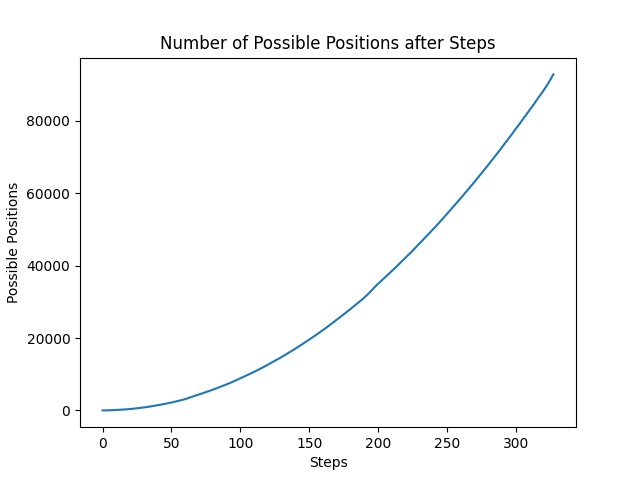

# Problem 21
| | Part 1 | Part 2 |
|---|---|---|
| Rank | 12524 | 4081 |
| Time | 08:11:53 | 09:28:52 |

[Question Source](https://adventofcode.com/2023/day/21)

    
Part 2 Context

    This part of the question changes the total number of steps to 26501365, and makes the map repeat infinitely in every direction.

## Thoughts
Part 1 was straightforward. It took me a while to find my bug where I reset the queue of new coordinates when iterating over the current queue, but I got the correct answer shortly afterwards.

Part 2 was more interesting. Upon looking at the number, I instantly knew I would not be bashing that one out (especially since part 1 had taken around half a second), so I decided to see if I could find patterns within the way the steps worked. Within the actual input (not the testing data), the row and column the starting coordinate is in is completely blank, as is the outer ring of the starting grid. The grid is also a square, which simplified things. Additionally, `26501365 % 131` (the length of the grid) is 65, which is exactly the number of steps it takes to reach the edge of the first grid. I ate breakfast after this since it was ready, then decided to plot the relationship  between the number of steps and the number of coordinates that could be reached (I did not expect to ever use MatPlotLib during AoC, but here we are), and noticed that it looked similar to a quadratic. I decided to use quadratic polynomial interpolation for values `0`, `131`, and `131*2`, courtesy of [WolframAlpha](https://www.wolframalpha.com/input?i=interpolating+polynomial+calculator). When that didn't work, I did the same thing for `65`, `65+131`, and `65+131*2` and got the correct answer.

Had that not worked, I would've tried off-by-one and off-by-two answers to account for rounding. Interestingly enough, when I was refactoring the code to use numpy's aproximation (to automatically do the calculations), my new answer was off by 1.

## Significance
My favorite Advent questions are the ones that force me to think outside the box and make me look for patterns within either the input or behavior, because then it feels as though I'm experimenting with the problem. This question was a great mix of both. After coding up a bashy solution for part 2 and letting it run in the background, I started looking at the input to see if there were any patterns I could find within it.

The testing graph they provided did not have what our actual inputs had: most of the plots did not have rocks, and every plot that was directly horizontal and vertical of the starting point (denoted by `S`) was rock-free. Additionally, the edge of the map was always clear of rocks. Thus, I reasoned that the total number of places that the elf could be in could be approximated by a quadratic, especially at the values that would correspond to some of the possible plot locations to spread to the edges.

This was probably my favorite Advent question out of all the ones posted this year. If I wanted to expand on this in the future, I would try to code an explict solution (that does not use polynomial interpolation); I would likely utiilze the fact that `26501365` is an odd number and that the possible plots spread in a checkerboard-like fashion.