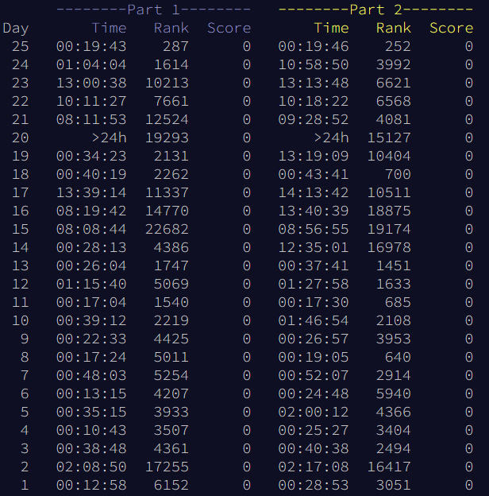

# aoc-2023 Reorganized

These were my solutions for [Advent of Code 2023](https://adventofcode.com/2023). I kept the solutions mostly the same as how I had it while coding during the competition, with some edits to explain my code and thought process while coding it out (for the original code, refer to [this repository](https://github.com/Ruminere/aoc-2023)). Thus, some code may be messy.

I have added comments for questions [12](./12/), [17](./17/), and [21](./21/), since I feel as those questions best showcase my skills (and because 12 and 21 were my favorite ones from this year). You are free to peruse my code for the other days as well.



## Running
Due to copyright concerns, u/topaz (the creator of AoC) has requested for us to not share our inputs. Thus, you will have to source them yourself from the site:
- Create an account on [AoC](https://adventofcode.com/). (You will not be able to get an input without an account.)
- Click on any question from any day. (You are able to access all the questions in any order without having to access earlier questions, provided that you have an account on AoC.)
- Scroll to the bottom of the page.
- Copy the input to the corresponding question folder and create a file called `actual.in`.
- Simply execute the makefile by typing `make`.
Below is what a correctly set up folder directory might look like. The important part is where the `actual.in` file is: each `actual.in` file must be in the same directory as its corresponding `main.py` file. Certain directories have an additional `main1.py` folder; in that case, the code for part 1 of the question is in `main.py`, while the code for part 2 is in `main1.py`.
```
├── 11
│   ├── README.md
│   ├── actual.in
│   ├── main.py
│   └── makefile
```
